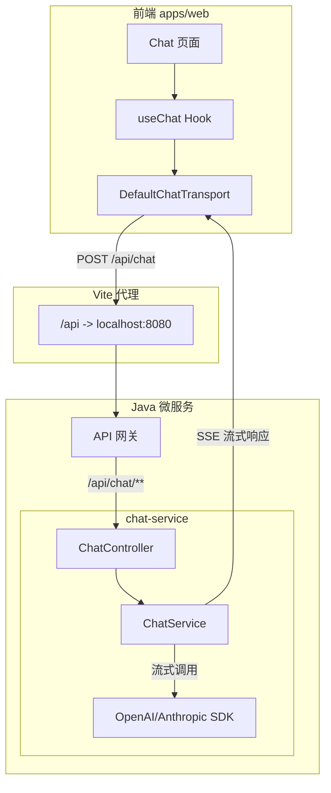
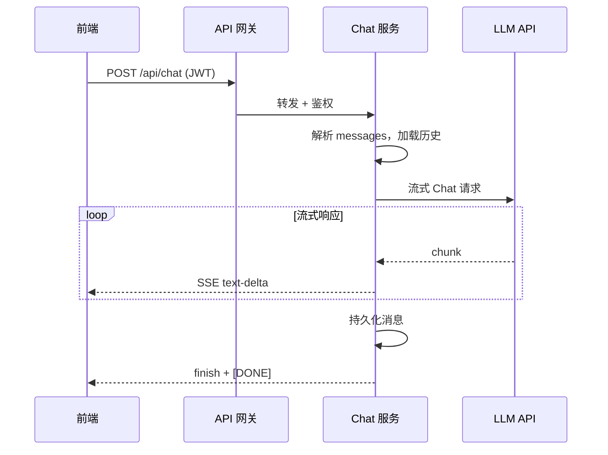

# Chat 后端实现计划

## 文档结构

本计划为 Chat 功能的后端部分，前端实现见 [01-前端实现计划.md](./01-前端实现计划.md)。

| 文档 | 说明 |
|------|------|
| **02-后端实现计划.md**（本文档） | 后端实现：chat-service、SSE 协议、LLM 对接、持久化 |
| [01-前端实现计划.md](./01-前端实现计划.md) | 前端实现：useChat、组件、UX、接口对接 |
| [vercel-ai-sdk-guide.md](./vercel-ai-sdk-guide.md) | Vercel AI SDK 使用指南 |

---

## 〇、架构决策：Chat 独立微服务

**建议：单独创建 `chat-service` 微服务**，与现有 `user-service`、`order-service` 并列。

| 考量 | 独立 chat-service | 合并到 user-service |
|------|------------------|-------------------|
| **职责** | Chat 专属：SSE 流式、LLM 调用、会话持久化 | 用户服务职责混杂 |
| **依赖** | LLM SDK、会话 DB | 与用户 DB 耦合 |
| **扩缩容** | 可独立扩缩（Chat 流量波动大） | 与用户服务绑定 |
| **技术栈** | Spring WebFlux（响应式 SSE）更合适 | 与现有 Spring MVC 混用 |
| **团队** | 可独立迭代、部署 | 与用户功能耦合 |

**结论**：新建 `services/chat-service/`，通过 API 网关路由 `/api/chat/**` → `chat-service`。

---

## 一、技术选型与架构

### 1.1 技术栈

| 层级 | 技术 | 说明 |
|------|------|------|
| **后端** | Java 微服务（Spring Boot / Spring WebFlux） | SSE 流式响应，对接 OpenAI/Anthropic 等 |
| **认证** | JWT（已有 `@repo/services` + `@repo/utils`） | Chat API 需携带 Token |

### 1.2 整体架构



### 1.3 服务目录结构（新增 chat-service）

```
services/
├── pom.xml
├── api-common/
├── api-gateway/
├── user-service/
├── order-service/
└── chat-service/              # 新增：Chat 独立微服务
    ├── pom.xml
    ├── Dockerfile
    └── src/main/
        ├── java/.../
        │   ├── ChatApplication.java
        │   ├── controller/ChatController.java
        │   ├── service/ChatService.java
        │   ├── sse/SseStreamWriter.java
        │   └── config/...
        └── resources/
            ├── application.yml
            └── application-docker.yml
```

### 1.4 API 网关路由

**api-gateway/application.yml** 新增：

```yaml
- id: chat-service
  uri: lb://chat-service
  predicates:
    - Path=/api/chat/**
  # SSE 流式连接需更长超时，可单独配置
  metadata:
    response-timeout: 60000  # 60 秒（流式响应可能较长）
```

**父 POM 更新**（`services/pom.xml` 的 `<modules>` 中新增）：

```xml
<module>chat-service</module>
```

### 1.5 流式协议选择

Vercel AI SDK 支持两种协议：

| 协议 | 复杂度 | 能力 | 推荐场景 |
|------|--------|------|----------|
| **Text Stream** | 低 | 纯文本流 | 简单对话，Java 实现成本低 |
| **Data Stream** | 中 | 文本 + Tool 调用 + 元数据 | 需 Tool、结构化数据时 |

**建议**：优先实现 **Data Stream**（`toUIMessageStreamResponse` 对应协议），与 AI SDK 默认行为一致，便于后续扩展 Tool 调用。Java 后端按 [Stream Protocol 文档](https://sdk.vercel.ai/docs/ai-sdk-ui/stream-protocol) 输出 SSE 即可。

---

## 二、接口契约

### 2.1 请求格式

**POST** `/api/chat`

**Headers**：

- `Content-Type: application/json`
- `Authorization: Bearer <access_token>`

**Body**（AI SDK 默认格式）：

```json
{
  "messages": [
    {
      "id": "msg_xxx",
      "role": "user",
      "parts": [{ "type": "text", "text": "你好" }]
    }
  ],
  "conversationId": "conv_xxx"
}
```

- `messages`：对话消息列表（AI SDK 格式）
- `conversationId`：可选，用于加载历史、会话持久化

### 2.2 响应格式（Data Stream Protocol）

**Headers**：

- `Content-Type: text/event-stream`
- `x-vercel-ai-ui-message-stream: v1`
- `Cache-Control: no-cache`
- `Connection: keep-alive`

**SSE 事件序列**（最小实现）：

1. `data: {"type":"start","messageId":"msg_xxx"}`
2. `data: {"type":"text-start","id":"text_xxx"}`
3. `data: {"type":"text-delta","id":"text_xxx","delta":"你"}`
4. `data: {"type":"text-delta","id":"text_xxx","delta":"好"}`
5. `data: {"type":"text-end","id":"text_xxx"}`
6. `data: {"type":"finish"}`
7. `data: [DONE]`

完整协议见 [Stream Protocols](https://sdk.vercel.ai/docs/ai-sdk-ui/stream-protocol)。

---

## 三、Java 实现要点

### 3.1 技术选型

- **chat-service**：独立微服务，端口建议 8003（与 user-service 8001、order-service 8002 并列）
- **Spring WebFlux**：`Flux<ServerSentEvent>` 或 `SseEmitter` 输出 SSE（响应式更适合长连接流式）
- **Spring AI**：`ChatClient` / `StreamingChatClient` 对接 OpenAI、Anthropic 等
- **API 网关**：`/api/chat/**` 路由到 `lb://chat-service`

### 3.2 核心流程



### 3.3 Java 实现要点

1. **SSE 输出**：使用 `SseEmitter` 或 `Flux<ServerSentEvent>`，按协议顺序发送 `start`、`text-start`、`text-delta`、`text-end`、`finish`、`[DONE]`
2. **消息转换**：将前端 `UIMessage[]` 转为 LLM 所需格式（如 OpenAI `ChatCompletionMessage`）
3. **流式消费**：Spring AI `StreamingChatClient.stream()` 或 OpenAI Java SDK 的 `Stream`，逐 chunk 写入 SSE
4. **持久化**：流结束后将 `messages` 写入 DB（MySQL/PostgreSQL），关联 `conversationId`
5. **鉴权**：从 `Authorization` 解析 JWT，校验用户身份，限流

**System prompt 配置**（主流产品标配）：

- 后端需支持可配置的 `system` 指令，用于定义 AI 角色、语气、能力边界
- 建议包含：角色描述、不确定性表达（如「当我不确定时会说明」）、优雅降级指引（如「无法理解时请用户换一种说法」）
- 示例：`"You are a helpful assistant. When unsure, say so and suggest rephrasing."`

### 3.4 消息存储设计（建议）

| 表 | 说明 |
|----|------|
| `conversation` | id, user_id, title, created_at, updated_at |
| `message` | id, conversation_id, role, content, created_at |

### 3.5 主流趋势后端扩展（可选）

| 能力 | 说明 | Java 实现要点 |
|------|------|---------------|
| **Resume Streams** | 断线续传 | 响应头 `Last-Event-ID`，客户端重连时带 `Last-Event-ID`，服务端从断点续发 |
| **Reasoning** | 思维链 | 若 LLM 返回 reasoning tokens，按协议输出 `reasoning-start`、`reasoning-delta`、`reasoning-end` |
| **Sources** | 引用来源 | Perplexity/Google 等 API 返回 sources 时，按协议输出 `source-url` / `source-document` |
| **Message Metadata** | Token 用量 | `finish` 事件中附带 `totalUsage`，供前端展示 |

### 3.6 会话标题自动生成（ChatGPT 模式）

- 首条用户消息发送后，根据首条消息内容生成会话标题（如调用 LLM 摘要或截取前 N 字）
- 在 `finish` 事件或单独接口中返回 `conversationTitle`，供前端更新侧边栏

---

## 四、实施阶段建议

| 阶段 | 内容 | 预计 |
|------|------|------|
| **1. 后端接口** | 新建 chat-service、实现 SSE 协议、对接 LLM、鉴权、网关路由 | 3-5 天 |
| **2. 联调与优化** | 前后端联调、流式体验、限流与安全 | 2-3 天 |

---

## 五、验收要点

### 5.1 核心功能

- SSE 流式响应符合 Data Stream 协议
- 消息持久化（后端存储）
- JWT 鉴权、未登录返回 401
- 错误处理（网络、限流、Token 过期）
- 会话标题自动生成（可选）

### 5.2 主流趋势对齐

- System prompt 可配置
- 优雅降级：模型不确定时回复引导性文案
- Resume Streams、Reasoning、Sources、Message Metadata（可选）

---

## 六、参考文档

| 文档 | 链接 |
|------|------|
| AI SDK Stream Protocol | [https://sdk.vercel.ai/docs/ai-sdk-ui/stream-protocol](https://sdk.vercel.ai/docs/ai-sdk-ui/stream-protocol) |
| Chatbot Resume Streams | [https://sdk.vercel.ai/docs/ai-sdk-ui/chatbot-resume-streams](https://sdk.vercel.ai/docs/ai-sdk-ui/chatbot-resume-streams) |
| OpenAI 优秀 ChatGPT 应用指南 | [What makes a great ChatGPT app](https://developers.openai.com/blog/what-makes-a-great-chatgpt-app) |
| 注册登录计划（JWT 上下文） | [注册登录功能实现计划](../注册登录功能实现计划/README.md) |
