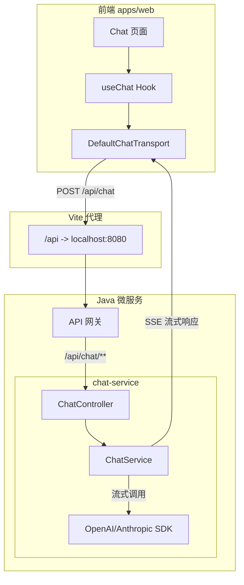

# Chat 功能实现计划

## 文档结构

本计划按前端与后端拆分为两个独立文档，便于分角色、分阶段执行和跟踪：

| 文档 | 说明 |
|------|------|
| **[01-前端实现计划.md](./01-前端实现计划.md)** | 前端实现：useChat、组件、UX 趋势、接口对接、Mock 策略 |
| **[02-后端实现计划.md](./02-后端实现计划.md)** | 后端实现：chat-service、SSE 协议、LLM 对接、持久化、接口契约 |
| [vercel-ai-sdk-guide.md](./vercel-ai-sdk-guide.md) | Vercel AI SDK 使用指南：安装、useChat、Transport、消息持久化、工具调用 |

---

## 快速概览

### 技术栈

| 层级 | 技术 | 说明 |
|------|------|------|
| **前端** | React + Vercel AI SDK (`ai`, `@ai-sdk/react`) | `useChat` + `DefaultChatTransport`，流式 UI |
| **前端框架** | React Router | 已有 `(chat)` 路由组 |
| **后端** | Java 微服务（Spring Boot / Spring WebFlux） | SSE 流式响应，对接 OpenAI/Anthropic 等 |
| **认证** | JWT（已有 `@repo/services` + `@repo/utils`） | Chat API 需携带 Token |

### 架构决策

**Chat 独立微服务**：新建 `services/chat-service/`，通过 API 网关路由 `/api/chat/**` → `chat-service`，与 `user-service`、`order-service` 并列。

### 整体架构

---

## 实施阶段建议

| 阶段 | 内容 | 预计 |
|------|------|------|
| **1. 前端基础** | 安装 AI SDK、实现 useChat + 基础 UI、Mock 或代理到占位接口 | 2-3 天 |
| **2. 前端完善** | 会话列表、持久化、Markdown 渲染、错误处理、Stop/Regenerate | 2-3 天 |
| **3. 主流 UI** | 侧边栏可折叠、会话重命名、欢迎空状态 + 快捷提示词、消息操作、键盘快捷键 | 1-2 天 |
| **4. 后端接口** | 新建 chat-service、实现 SSE 协议、对接 LLM、鉴权、网关路由 | 3-5 天 |
| **5. 联调与优化** | 前后端联调、流式体验、限流与安全、无障碍验证 | 2-3 天 |

---

## 验收要点

### 核心功能

- 多轮对话、流式打字机效果
- 会话列表、新建/切换/删除会话
- 消息持久化（后端存储）
- JWT 鉴权、未登录跳转登录页
- 错误处理（网络、限流、Token 过期）
- Stop 停止生成、Regenerate 重新生成

### 主流趋势对齐

- 极简聊天窗口、可折叠侧边栏
- 会话重命名或自动生成标题
- 欢迎/空状态、快捷提示词（Suggested Prompts）
- 消息操作：复制、删除、👍/👎 反馈（可选）
- Markdown 渲染（代码高亮、表格等）
- 键盘快捷键：Enter 发送、Shift+Enter 换行
- 信任与预期管理：可选免责声明
- 优雅降级：错误态提供「重试」或「换个说法」按钮

### 设计与无障碍

- 符合设计系统（`@repo/ui`、Tailwind、主题变量）
- 响应式布局（移动端侧边栏可折叠）
- 键盘导航、ARIA 属性、屏幕阅读器友好

---

## 参考文档

| 文档 | 链接 |
|------|------|
| AI SDK Stream Protocol | [https://sdk.vercel.ai/docs/ai-sdk-ui/stream-protocol](https://sdk.vercel.ai/docs/ai-sdk-ui/stream-protocol) |
| AI SDK Chatbot 指南 | [https://sdk.vercel.ai/docs/ai-sdk-ui/chatbot](https://sdk.vercel.ai/docs/ai-sdk-ui/chatbot) |
| OpenAI 优秀 ChatGPT 应用指南 | [What makes a great ChatGPT app](https://developers.openai.com/blog/what-makes-a-great-chatgpt-app) |
| 可信 AI 助手的 9 个 UX 模式 | [9 UX Patterns](https://orangeloops.com/2025/07/9-ux-patterns-to-build-trustworthy-ai-assistants/) |
| 项目 Vercel AI SDK 使用指南 | [vercel-ai-sdk-guide.md](./vercel-ai-sdk-guide.md) |
| 注册登录计划（JWT 上下文） | [注册登录功能实现计划](../注册登录功能实现计划/README.md) |
