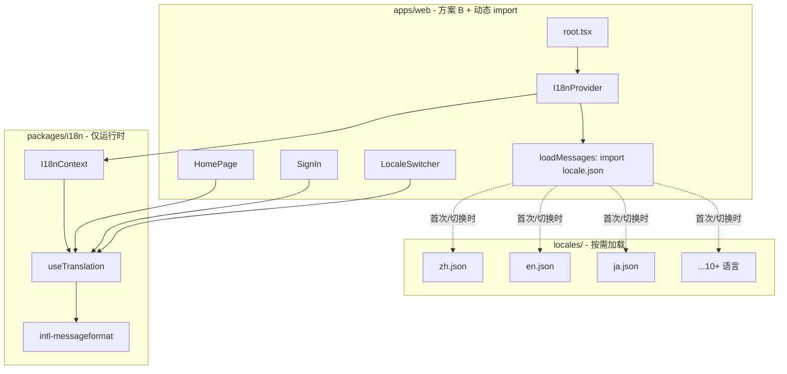

# apps/web 多语言切换实现计划

## 一、项目现状分析

### 1.1 相关包与依赖


| 包                     | 状态                                                 |
| --------------------- | -------------------------------------------------- |
| `packages/i18n`       | 空包，`[src/index.ts](packages/i18n/src/index.ts)` 为空 |
| `pnpm-workspace.yaml` | catalog 已包含 `intl-messageformat: 11.1.2`           |
| `apps/web`            | 未依赖 `@repo/i18n`，无 i18n 相关代码                       |


### 1.2 需要多语言化的页面

- `[apps/web/app/(home)/page.tsx](apps/web/app/(home)`/page.tsx)：首页，大量中文硬编码（菜单、特性、Hero、Footer 等）
- `[apps/web/app/(all)/sign-in/page.tsx](apps/web/app/(all)`/sign-in/page.tsx)：登录页，表单标签、按钮、Toast 文案
- `[apps/web/app/(all)/sign-up/page.tsx](apps/web/app/(all)`/sign-up/page.tsx)：注册页
- `[apps/web/app/root.tsx](apps/web/app/root.tsx)`：`<html lang="en">` 写死

### 1.3 可参考的模式

- `[packages/propel/src/theme/use-theme.ts](packages/propel/src/theme/use-theme.ts)`：Context + localStorage 持久化
- `[packages/propel/src/theme/toggle-mode.tsx](packages/propel/src/theme/toggle-mode.tsx)`：切换 UI 组件

---

## 二、架构设计




---

## 三、实现方案

### 3.1 packages/i18n 包实现

#### 3.1.1 依赖与导出

- 在 `[packages/i18n/package.json](packages/i18n/package.json)` 中添加 `intl-messageformat: catalog:` 依赖
- 导出：`I18nProvider`、`useTranslation`、`useLocale`、类型定义

#### 3.1.2 核心模块


| 文件                       | 职责                                                                 |
| ------------------------ | ------------------------------------------------------------------ |
| `src/context.tsx`        | `I18nProvider`，管理 locale 状态、messages 缓存、`loadMessages` 回调、切换函数     |
| `src/use-translation.ts` | `useTranslation()` 返回 `t(key, values)`，内部用 `IntlMessageFormat` 格式化 |
| `src/use-locale.ts`      | `useLocale()` 返回 `locale`、`setLocale`、`t`、`isLoading`（加载中状态）       |
| `src/types.ts`           | `Locale`、`Messages`、`I18nConfig`、`LoadMessagesFn` 等类型；`I18nConfig` 含 `isAuthenticated`、`onLocaleChange` 以支持双存储，见 [locale-cookie-backend.md](./locale-cookie-backend.md) |
| `src/index.ts`           | 统一导出                                                               |


#### 3.1.3 关键实现逻辑

- **消息格式化**：`t("common.save")` 或 `t("errors.required", { field: "用户名" })` 使用 `new IntlMessageFormat(message, locale).format(values)` 支持 ICU 语法（plural、select、变量插值）
- **locale 持久化**：
  - **未登录**：使用 localStorage（`LOCALE_STORAGE_KEY = "locale-preference"`），与 theme 模式一致
  - **已登录**：使用后端 Cookie，由后端 API 设置，前端切换时调用 API 更新。详见 [后端 Locale Cookie 方案](./locale-cookie-backend.md)
  - **优先级**：已登录时优先读 Cookie，未登录时读 localStorage；`setLocale` 根据登录状态选择写入目标
- **默认 locale**：`zh`（项目主要受众为中文）
- **支持 locale**：`zh`、`en` 及 10+ 种语言（可扩展）
- **按需加载**：通过 `loadMessages(locale): Promise<Messages>` 动态 import，仅加载当前/切换后的语言包
- **内存缓存**：已加载的 locale 缓存在 Context 中，切换回已加载语言时不再请求

#### 3.1.4 翻译文件位置与加载方式（方案 B + 动态 import）

**采用方案 B**：翻译文件放在 `apps/web/locales/`，由应用维护。

- 翻译内容与应用强相关，首页、登录等文案属于应用层
- 便于应用独立维护和扩展，无需修改共享包即可增减语言或文案
- `packages/i18n` 仅提供运行时能力（Context、hooks、IntlMessageFormat 封装），**不内置任何翻译文件**
- **动态 import 按需加载**：`I18nProvider` 接收 `loadMessages: (locale: string) => Promise<Messages>` 回调，应用内实现方式二选一：
  - **方式 1（推荐）**：`import.meta.glob('./locales/*.json')` 预声明所有语言，再 `modules[\`./locales/${locale}.json]()` 动态加载，Vite 为每种语言生成独立 chunk
  - **方式 2**：`import(\`./locales/${locale}.json)` 直接动态 import，Vite 会为匹配的 JSON 生成独立 chunk

---

### 3.2 apps/web 集成

#### 3.2.1 依赖

在 `[apps/web/package.json](apps/web/package.json)` 中添加 `@repo/i18n: workspace:*`。

#### 3.2.2 翻译文件（方案 B：应用层维护 + 动态 import）

翻译文件位于 `apps/web/locales/`，由应用维护，**按需动态加载**：

- `zh.json`、`en.json`、`ja.json`、`ko.json` 等 10+ 种语言
- 每种语言一个 JSON 文件，按 home、auth、common 等命名空间组织
- 通过 `loadMessages` 回调使用 `import.meta.glob` 或 `import()` 动态加载，Vite 为每种语言生成独立 chunk

**loadMessages 实现示例**（`apps/web/app/i18n/load-messages.ts`）：

```typescript
const modules = import.meta.glob<{ default: Messages }>("../../locales/*.json")

export async function loadMessages(locale: string): Promise<Messages> {
  const loader = modules[`../../locales/${locale}.json`]
  if (!loader) throw new Error(`Locale ${locale} not found`)
  const mod = await loader()
  return mod.default
}
```

从 `[(home)/page.tsx](apps/web/app/(home)`/page.tsx) 等页面提取的 key 示例：

```json
{
  "home": {
    "nav": { "home": "首页", "docs": "文档" },
    "hero": { "title": "构建下一代", "titleHighlight": "应用系统", "subtitle": "强大的开发平台...", "cta": "立即开始" },
    "features": { "title": "为什么选择我们", "subtitle": "我们提供企业级解决方案..." },
    "footer": { "privacy": "隐私政策", "terms": "服务条款", "contact": "联系我们" }
  },
  "auth": { "login": "登录", "signUp": "注册", "signInSuccess": "登录成功！正在跳转..." },
  "common": { "save": "保存", "cancel": "取消" }
}
```

#### 3.2.3 Provider 与 html lang

- 在 `[apps/web/app/root.tsx](apps/web/app/root.tsx)` 中：
  - 用 `I18nProvider` 包裹 `{children}`，传入 `loadMessages` 回调（实现为 `(locale) => import(\`./locales/${locale}.json)`）和 `defaultLocale="zh"`；已登录时传入 `isAuthenticated={true}` 和 `onLocaleChange`（调用 `PATCH /api/user/locale`），见 [locale-cookie-backend.md](./locale-cookie-backend.md)
  - 将 `<html lang="en">` 改为 `<html lang={locale}>`，`locale` 从 `useLocale` 或通过子组件获取（需在 Provider 内使用 hook，可通过包装组件解决）
- 若 React Router v7 的 `Layout` 在 `root.tsx` 中，可在 `Layout` 内使用 `useLocale()` 获取 `locale`，并传给 `html` 的 `lang` 属性；或创建 `HtmlLangSync` 组件在 Provider 内同步 `document.documentElement.lang`。
- **加载状态**：首次加载或切换语言时 `isLoading` 为 true，可显示骨架屏或占位文案，加载完成后自动更新。

#### 3.2.4 LocaleSwitcher 组件

- 位置：`apps/web/app/components/locale-switcher.tsx`（或 `core/components/`）
- 参考 `[ToggleMode](packages/propel/src/theme/toggle-mode.tsx)` 的 UI 风格
- 使用 `useLocale()` 获取 `locale`、`setLocale`、`isLoading`
- 提供下拉或按钮组切换 10+ 种语言
- 切换时若 `isLoading` 为 true，可显示加载指示（如禁用选项或 spinner）

#### 3.2.5 页面改造

- `[(home)/page.tsx](apps/web/app/(home)`/page.tsx)：将 `"首页"`、`"文档"`、`"构建下一代"` 等替换为 `t("home.nav.home")`、`t("home.hero.title")` 等
- `[(all)/sign-in/page.tsx](apps/web/app/(all)`/sign-in/page.tsx)：表单标签、按钮、Toast 使用 `t()`
- `[(all)/sign-up/page.tsx](apps/web/app/(all)`/sign-up/page.tsx)：同上

#### 3.2.6 布局中放置 LocaleSwitcher

- 在 `[(home)/page.tsx](apps/web/app/(home)`/page.tsx) 的 header 右侧，与 `ToggleMode` 并列放置 `LocaleSwitcher`

---

### 3.3 SSR 与 React Router 考虑（方案 B + 动态 import）

- **动态 import**：`loadMessages` 使用 `import(\`./locales/${locale}.json)`，Vite 为每种语言生成独立 chunk，仅在实际需要时加载，首屏只加载默认语言（zh），控制 bundle 体积。
- **SSR 行为**：服务端首次渲染时，`loadMessages(defaultLocale)` 在服务端执行，需确保 Node 环境支持动态 import；若 SSR 不支持，可降级为：服务端渲染占位/默认文案，客户端 hydration 后再加载并应用翻译（可能有轻微闪烁）。
- **推荐**：在 root 或 layout 的 `useEffect` 中调用 `loadMessages`，确保客户端优先；或使用 React Router loader 在服务端 `await loadMessages(locale)` 预加载默认语言。
- `useLocale` 依赖客户端存储（localStorage 或 Cookie），服务端需做兼容：`typeof window !== "undefined"` 时再读存储，否则使用 `defaultLocale`，避免 SSR 报错。已登录用户的 locale 从后端 Cookie 读取，需在 loader 或首次请求时解析。

---

## 四、文件变更清单


| 操作  | 路径                                                            |
| --- | ------------------------------------------------------------- |
| 修改  | `packages/i18n/package.json` - 添加 intl-messageformat          |
| 新增  | `packages/i18n/src/types.ts`                                  |
| 新增  | `packages/i18n/src/context.tsx`                               |
| 新增  | `packages/i18n/src/use-translation.ts`                        |
| 新增  | `packages/i18n/src/use-locale.ts`                             |
| 修改  | `packages/i18n/src/index.ts` - 导出所有 API                       |
| 修改  | `apps/web/package.json` - 添加 @repo/i18n                       |
| 新增  | `apps/web/locales/zh.json`、`en.json` 及 10+ 种语言 JSON           |
| 新增  | `apps/web/app/i18n/load-messages.ts` - 动态 import 实现           |
| 修改  | `apps/web/app/root.tsx` - I18nProvider、loadMessages、html lang |
| 新增  | `apps/web/app/components/locale-switcher.tsx`                 |
| 新增  | `.cursor/plans/多语言功能计划/locale-cookie-backend.md` - 后端 Cookie 方案文档 |
| 修改  | `apps/web/app/(home)/page.tsx` - 使用 t()、添加 LocaleSwitcher     |
| 修改  | `apps/web/app/(all)/sign-in/page.tsx` - 使用 t()                |
| 修改  | `apps/web/app/(all)/sign-up/page.tsx` - 使用 t()                |


---

## 五、验收标准

1. 切换 locale 后，页面文案即时切换为对应语言
2. 刷新页面后，locale 保持用户上次选择（未登录用 localStorage，已登录用后端 Cookie）
3. `<html lang>` 与当前 locale 一致
4. 支持 ICU 语法：`t("items", { count: 1 })` 可正确复数处理
5. **按需加载**：仅加载当前/切换后的语言包，10+ 种语言时首屏不包含未使用语言的 chunk
6. 符合项目规范：中文注释、Tailwind 样式、可访问性（LocaleSwitcher 的 aria-label）

---

## 六、后续扩展（可选）

- 通过 URL 路径前缀区分语言（如 `/zh/...`、`/en/...`）
- 增加更多语言（如 `ja`、`ko`）
- 按路由懒加载翻译文件以减小首屏体积

