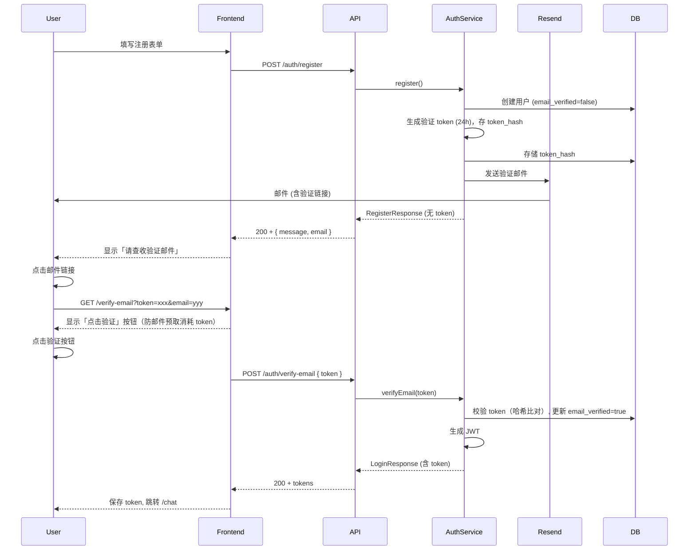

# Resend 注册邮箱验证实现计划

## 架构概览




## 一、后端实现

### 1.1 依赖与配置

**user-service/pom.xml** 添加 Resend Java SDK：

```xml
<dependency>
    <groupId>com.resend</groupId>
    <artifactId>resend-java</artifactId>
    <version>4.0.0</version>
</dependency>
```

**application.yml** 新增配置：

```yaml
# Resend 邮件配置
resend:
  api-key: ${RESEND_API_KEY:}  # 从环境变量读取，开发可空
  from: ${RESEND_FROM:onboarding@resend.dev}  # 需在 Resend 验证域名
  # 验证链接前缀：必须从可信配置读取，禁止从 Host 头或请求中获取，避免 Host Header Injection（OWASP）
  verification-link-base: ${APP_FRONTEND_URL:http://localhost:5573}

# 验证接口限流（防暴力枚举 token，参考 OWASP Forgot Password Cheat Sheet）
rate-limit:
  verify-email:
    max-attempts-per-ip: 10      # 每 IP 每小时最多 10 次验证尝试
    ip-window-seconds: 3600
```

### 1.2 数据库迁移

**V3__add_email_verification.sql**（新建）：

- `users` 表新增 `email_verified` (BOOLEAN, default false)、`email_verified_at` (DATETIME, nullable)
- 新建 `email_verification_tokens` 表：`id`, `user_id`, `token_hash`（SHA-256 哈希，非明文）, `expires_at`, `created_at`

### 1.3 实体与 Mapper

- [UserEntity.java](services/user-service/src/main/java/com/example/user/entity/UserEntity.java)：新增 `emailVerified`、`emailVerifiedAt`
- [UserMapper.xml](services/user-service/src/main/resources/mapper/UserMapper.xml)：更新 resultMap、insert、update
- 新建 `EmailVerificationTokenEntity`（含 `tokenHash` 字段）、`EmailVerificationTokenMapper` 及 XML

### 1.4 api-common 新增 DTO

- `RegisterResponse`：`{ message: string, email: string }`（无 token，用于「请查收邮件」）
- `VerifyEmailRequest`：`{ token: string }`
- `ResendVerificationRequest`：`{ email: string }`

### 1.5 EmailVerificationService（新建）

- `generateAndSendVerificationEmail(userId, email)`：
  - 使用 cryptographically secure 随机数生成 **64–128 字符** token（如 `SecureRandom` + Base64URL）
  - 存储 **SHA-256 哈希**到 DB（`token_hash`），不存明文，降低泄露风险
  - 过期时间 24h，存 DB，调用 Resend 发邮件
  - **URL 构建**：验证链接必须使用配置中的 `verification-link-base`，禁止从 Host 头或请求中获取（防 Host Header Injection）；链接格式为 `/verify-email?token=xxx&email=yyy`，`email` 经 URL 编码后附带，便于前端 resend 时无需用户输入
- `verifyEmail(token)`：对传入 token 做 SHA-256 后与 DB 比对、校验未过期、更新 `email_verified`、删除 token、返回 `UserEntity`
- `resendVerificationEmail(email)`：
  - 限流（每用户每小时 3 次）、重新发送；调用 Resend 时传入 **UUID 作为 idempotency key**，避免重试导致重复发信
  - **用户枚举防护（OWASP）**：无论邮箱是否存在、是否已验证，均返回 200 + 相同成功消息；仅当限流触发时返回 429；避免通过响应差异枚举用户

### 1.6 RateLimitService 扩展

- [RateLimitService](services/user-service/src/main/java/com/example/user/service/RateLimitService.java)：新增 `checkRateLimitForVerifyEmail(ipAddress)`，按 IP 限流（每 IP 每小时 10 次），配置项 `rate-limit.verify-email.*`；用于 `POST /api/auth/verify-email` 防暴力枚举 token

### 1.7 AuthService 修改

- [AuthService.register()](services/user-service/src/main/java/com/example/user/service/AuthService.java)：创建用户后**不生成 JWT**，调用 `EmailVerificationService.generateAndSendVerificationEmail()`，返回 `RegisterResponse`
- [AuthService.login()](services/user-service/src/main/java/com/example/user/service/AuthService.java)：**硬验证必须**：若 `emailVerified == false`，拒绝登录，返回明确错误码（如 `EMAIL_NOT_VERIFIED`）及提示「请先完成邮箱验证」；否则从 DB 读取 `emailVerified` 并写入 `LoginResponse.user.emailVerified`
- 新建 `AuthService.verifyEmail(token)`：调用 `EmailVerificationService.verifyEmail()`，生成 JWT 并返回 `LoginResponse`
- 新建 `AuthService.resendVerification(email)`：调用 `EmailVerificationService.resendVerificationEmail()`

### 1.8 AuthController 修改

- [AuthController.register()](services/user-service/src/main/java/com/example/user/controller/AuthController.java)：返回类型改为 `RegisterResponse`
- 新增 `POST /api/auth/verify-email`：请求体 `VerifyEmailRequest`，返回 `LoginResponse`；**限流**：调用 `RateLimitService.checkRateLimitForVerifyEmail(ipAddress)` 后再执行验证（防暴力枚举 token，参考 OWASP Forgot Password Cheat Sheet）
- 新增 `POST /api/auth/resend-verification`：请求体 `ResendVerificationRequest`，返回 `Result<Void>`；限流由 `EmailVerificationService.resendVerificationEmail` 内部处理

### 1.9 开发环境兜底

- `RESEND_API_KEY` 为空时：不调用 Resend，将验证链接打印到日志（开发用）
- 或使用 Resend 测试域名 `onboarding@resend.dev`（仅能发往已添加的测试邮箱）

---

## 二、前端实现

### 2.1 路由

- [routes/core.ts](apps/web/app/routes/core.ts)：新增 `layout("./(all)/verify-email/layout.tsx", [route("verify-email", "./(all)/verify-email/page.tsx")])`

### 2.2 验证页（verify-email）

- 新建 `apps/web/app/(all)/verify-email/page.tsx`、`verify-email/layout.tsx`
- **Referrer 策略（OWASP）**：在 `verify-email/layout.tsx` 的 `meta` 中增加 `{ name: "referrer", content: "no-referrer" }`、`{ name: "robots", content: "noindex, nofollow" }`，避免带 token 的 URL 通过 Referer 泄露到第三方
- 从 `useSearchParams()` 读取 `token`、`email`（验证链接格式：`/verify-email?token=xxx&email=yyy`，`email` 由后端在邮件链接中附带，用于 resend 时无需用户输入）
- **无 token**：显示「链接无效或已过期」，提供「立即注册」「立即登录」入口
- **有 token**：**不自动调用 API**，先显示「点击验证」按钮（防止 Gmail/Outlook 等邮件客户端预取链接消耗 token）；用户**点击按钮后**才调用 `authVerifyEmail(token)`
  - **成功**：Token 由 `api.service.base.ts` 响应拦截器自动保存，toast 成功，按钮显示「验证成功！正在跳转...」并禁用，2 秒后跳转 `/chat`
  - **失败**：显示错误；若 URL 含 `email` 则直接显示「重新发送」按钮；若无 `email`（旧链接）则显示邮箱输入框（`autoComplete="email"`），用户输入后点击「重新发送」

### 2.3 注册页修改

- [sign-up/page.tsx](apps/web/app/(all)/sign-up/page.tsx)：注册成功后不再跳转 `/chat`
- 根据响应类型判断：若为 `RegisterResponse`（无 `accessToken`），显示「请验证您的邮箱」提示，并展示 `email`、「重新发送验证邮件」按钮、「使用其他邮箱」按钮（点击可返回表单修改邮箱）

### 2.4 服务层

- [auth.service.ts](packages/services/src/auth.service.ts)：新增 `authVerifyEmail(token)`、`authResendVerification(email)`；注册接口返回类型为 `RegisterResponse`
- [api.service.base.ts](packages/services/src/api.service.base.ts)：响应拦截器对 `/auth/login`、`/auth/verify-email` 返回的 `LoginResponse` 自动调用 `saveTokens` 保存 token

### 2.5 登录页修改

- [sign-in/page.tsx](apps/web/app/(all)/sign-in/page.tsx)：登录失败且错误码为 `EMAIL_NOT_VERIFIED` (40109) 时，在错误提示下方显示「重新发送验证邮件」按钮，点击后使用当前表单邮箱调用 `authResendVerification`

### 2.6 国际化

- [zh.json](apps/web/locales/zh.json)、[en.json](apps/web/locales/en.json)：新增 `auth.checkEmail`、`auth.checkEmailTitle`、`auth.checkEmailDesc`、`auth.verifySuccess`、`auth.verifying`、`auth.resendVerification`、`auth.resendVerificationSuccess`、`auth.resendVerificationFailed`、`auth.resendEnterEmail`、`auth.useDifferentEmail`、`auth.invalidLink`、`auth.invalidLinkDesc`、`auth.clickToVerify`、`auth.signUpNow`、`auth.signInNow`、`auth.hasAccount` 等文案

---

## 三、关键文件清单


| 层级         | 操作  | 文件                                                                                                                                                                                                                     |
| ---------- | --- | ---------------------------------------------------------------------------------------------------------------------------------------------------------------------------------------------------------------------- |
| 后端         | 修改  | `user-service/pom.xml`、`application.yml`、`UserEntity.java`、`UserMapper.xml`、`AuthService.java`、`AuthController.java`、`RateLimitService.java`                                                                           |
| 后端         | 新建  | `V3__add_email_verification.sql`、`EmailVerificationTokenEntity.java`、`EmailVerificationTokenMapper`、`EmailVerificationService.java`、`RegisterResponse.java`、`VerifyEmailRequest.java`、`ResendVerificationRequest.java` |
| api-common | 新建  | `RegisterResponse.java`、`VerifyEmailRequest.java`、`ResendVerificationRequest.java`                                                                                                                                     |
| 前端         | 修改  | `routes/core.ts`、`sign-up/page.tsx`、`sign-in/page.tsx`、`auth.service.ts`、`api.service.base.ts`、`zh.json`、`en.json`                                                                                                   |
| 前端         | 新建  | `verify-email/page.tsx`、`verify-email/layout.tsx`                                                                                                                                                                      |


---

## 四、Resend 前置准备

1. 注册 [resend.com](https://resend.com)，创建 API Key
2. 验证发件域名（生产）或使用 `onboarding@resend.dev`（仅测试邮箱）
3. 环境变量：`RESEND_API_KEY`、`RESEND_FROM`、`APP_FRONTEND_URL`

---

## 五、验收标准

- 注册后不返回 token，仅提示「请查收验证邮件」
- 点击邮件链接进入验证页，**点击「点击验证」按钮**后完成验证并自动登录跳转 `/chat`
- **未验证用户无法登录**：login 必须检查 `emailVerified`，未验证则拒绝并返回 `EMAIL_NOT_VERIFIED` 及提示「请先完成邮箱验证」
- 重新发送验证邮件限流生效
- 开发环境无 API Key 时，验证链接输出到日志可正常验证
- **验证接口限流**：`POST /auth/verify-email` 每 IP 每小时超过 10 次返回 429
- **Referrer 策略**：验证页 HTML 包含 `<meta name="referrer" content="no-referrer" />`、`<meta name="robots" content="noindex, nofollow" />`
- **用户枚举防护**：`POST /auth/resend-verification` 对不存在的邮箱也返回 200 + 相同成功消息

---

## 六、主流实践与安全要点

以下设计对齐国外主流实践（OWASP、SuperTokens、Bouncer、FusionAuth 等）：

| 要点 | 实现方式 | 说明 |
|------|----------|------|
| **邮件预取防护** | 验证页显示「点击验证」按钮，用户点击后才调用 API | Gmail/Outlook 等会预取链接做安全扫描，可能消耗 token；仅人类点击按钮才触发验证 |
| **Token 存储安全** | DB 存 SHA-256 哈希，不存明文 | 降低 token 泄露风险，符合 Bouncer 等建议 |
| **Token 生成** | 64–128 字符 cryptographically secure 随机数 | 降低暴力破解风险 |
| **Resend 幂等性** | 调用 Resend 时传入 UUID 作为 idempotency key | 避免重试导致重复发信，符合 Resend 官方建议 |
| **硬验证一致性** | login 必须拒绝未验证用户 | 硬验证模式下，未验证用户不得登录，保持策略一致 |
| **验证接口限流** | `POST /auth/verify-email` 每 IP 每小时 10 次 | 防暴力枚举 token，符合 OWASP Forgot Password Cheat Sheet |
| **Referrer 策略** | 验证页设置 `Referrer-Policy: noreferrer` | 避免带 token 的 URL 通过 Referer 泄露到第三方 |
| **URL 构建安全** | 验证链接仅从配置 `verification-link-base` 读取 | 禁止从 Host 头或请求中获取，防 Host Header Injection（OWASP） |
| **用户枚举防护** | `resendVerification` 无论邮箱是否存在均返回相同成功消息 | 避免通过响应差异枚举用户，符合 OWASP 建议 |

---

## 七、实现完成说明（2026-02）

### 7.1 验证链接格式

- 后端 `EmailVerificationService` 生成的验证链接为 `/verify-email?token=xxx&email=yyy`，`email` 参数便于前端在验证失败时直接调用 resend，无需用户再次输入

### 7.2 已实现功能

- 后端：注册、登录（含 `EMAIL_NOT_VERIFIED` 检查）、verify-email、resend-verification、限流、Resend 集成、用户枚举防护
- 前端：verify-email 页（含无 token、有 token、成功/失败、resend 等分支）、sign-up 页（请查收邮件、使用其他邮箱）、sign-in 页（EMAIL_NOT_VERIFIED 时显示重新发送）
- Token 保存：由 `api.service.base.ts` 响应拦截器自动处理 login/verify-email 的 `LoginResponse`

### 7.3 测试覆盖

- 前端：sign-up、sign-in、verify-email 页面测试（含 act 警告修复）
- 后端：AuthControllerTest 集成测试（含 Testcontainers Redis）

