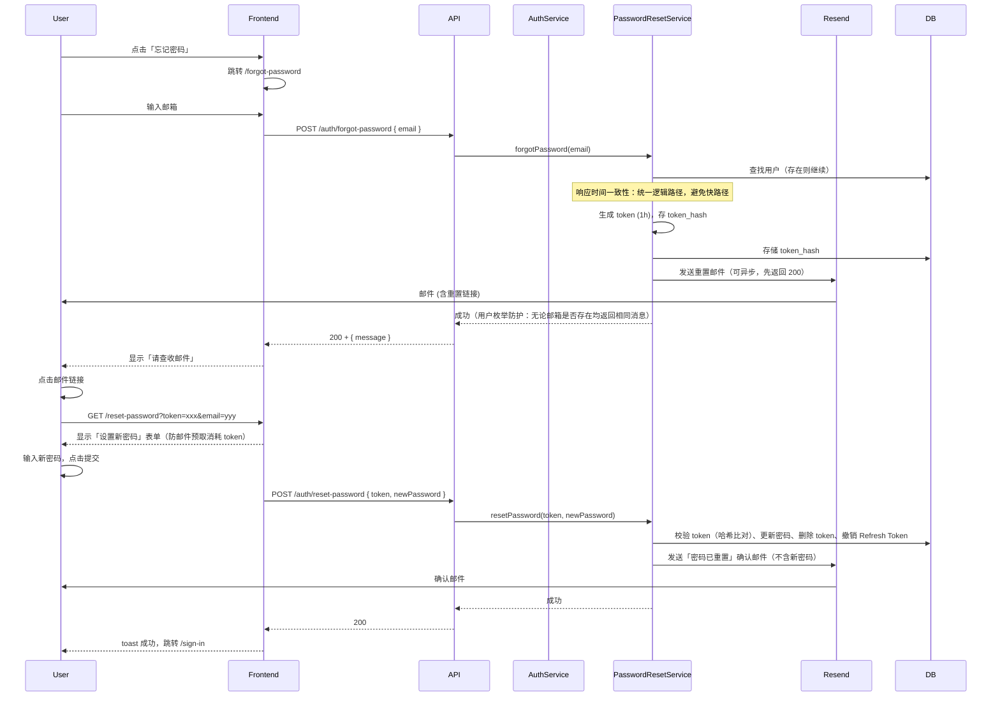

# 密码重置实现计划（概览）

> **拆分文档**：
> - 后端实现：[12a-密码重置-后端.md](./12a-密码重置-后端.md)
> - 前端实现：[12b-密码重置-前端.md](./12b-密码重置-前端.md)

## 架构概览

---

## 与注册邮箱验证的差异

| 项目           | 邮箱验证                         | 密码重置                               |
| -------------- | -------------------------------- | -------------------------------------- |
| Token 有效期   | 24h                              | 1h                                     |
| 表名           | `email_verification_tokens`       | `password_reset_tokens`                |
| 成功后续操作   | 返回 LoginResponse，自动登录      | 仅返回成功，跳转登录页手动登录         |
| 限流维度       | verify: IP；resend: 每邮箱        | forgot: IP+邮箱；reset: IP             |
| 重置后操作     | -                                 | 撤销 Refresh Token（默认）、发送确认邮件 |

---

## 主流实践与安全要点（45 项对照）

以下设计对齐 OWASP Forgot Password Cheat Sheet、Auth0、SuperTokens、GitHub、Stripe、NIST 等：

### 核心安全（必备）

| # | 要点               | 实现方式                                                                 | 参考 |
|---| ------------------ | ------------------------------------------------------------------------ | ---- |
| 1 | **用户枚举防护**   | `forgot-password` 无论邮箱是否存在均返回 200 + 相同成功消息               | OWASP |
| 2 | **响应时间一致性** | 无论邮箱是否存在，执行相同逻辑路径；发邮件可异步或固定延迟                 | OWASP |
| 3 | **Token 存储安全** | DB 存 SHA-256 哈希，不存明文                                             | OWASP, SuperTokens |
| 4 | **Token 生成**     | 64 字符 cryptographically secure 随机数（SecureRandom + Base64URL）       | SuperTokens |
| 5 | **Token 有效期**   | 1 小时（可配置，高安全场景可缩短至 15–30 分钟）                           | OWASP |
| 6 | **Token 单次使用** | 使用后立即删除                                                           | OWASP |
| 7 | **忘记密码限流**   | 每 IP 5 次/h、每邮箱 3 次/h                                             | OWASP |
| 8 | **重置接口限流**   | `POST /auth/reset-password` 每 IP 每小时 10 次                           | OWASP |
| 9 | **URL 构建安全**   | 重置链接仅从配置 `verification-link-base` 读取，禁止从 Host 头获取         | OWASP |
| 10 | **HTTPS 强制**    | 生产环境 `verification-link-base` 必须为 `https://`                      | OWASP |
| 11 | **Referrer 策略**  | 重置页设置 `Referrer-Policy: noreferrer`                                 | OWASP |
| 12 | **robots 策略**    | 重置页设置 `robots: noindex, nofollow`                                   | 防索引 |
| 13 | **邮件预取防护**   | 重置页显示表单，用户点击提交后才调用 API，不预取                           | 与 verify-email 一致 |
| 14 | **密码二次确认**   | 新密码 + 确认密码，Zod schema 校验                                       | OWASP |
| 15 | **不自动登录**     | 成功后跳转 `/sign-in` 手动登录                                           | OWASP |
| 16 | **不锁定账户**     | forgot-password 不触发账户锁定，避免拒绝服务                              | OWASP |
| 17 | **重置成功确认邮件** | 成功后发送「密码已重置」邮件（**不含新密码**）                         | OWASP |
| 18 | **撤销 Refresh Token** | 重置成功后默认撤销该用户所有 Refresh Token                           | OWASP |

### 进阶与可选

| # | 要点               | 实现方式                                                                 | 参考 |
|---| ------------------ | ------------------------------------------------------------------------ | ---- |
| 25 | **CAPTCHA**       | 限流触发时可选展示 reCAPTCHA v3 / Cloudflare Turnstile                    | OWASP |
| 28 | **密码强度指示器** | 前端实时显示强度条（可选，参考 Auth0、1Password）                         | 国外主流计划 P3-5 |
| 29 | **可访问性**      | 表单含 `aria-invalid`、`aria-describedby`、`role="alert"`，支持键盘导航    | WCAG |
| 31 | **MFA 不绕过**     | 若用户已启用 MFA，重置后登录仍需 MFA；重置流程安全级别不低于主认证           | OWASP WSTG |
| 32 | **CSRF 防护**      | forgot/reset 表单使用 CSRF token（框架内置或自定义）                        | OWASP |
| 33 | **密码复用校验**   | 可选：拒绝新密码与当前密码相同；高安全可检查 breached password 列表         | NIST |
| 42 | **人工恢复路径**   | 提供「无法收到邮件？请联系支持」入口，确保用户始终可恢复账户                   | OWASP |

---

## 要实现的功能计划

以下将「进阶与可选」及「进阶扩展」纳入可执行的功能计划，按优先级与归属拆分。

### 第一阶段：核心功能（必备）

| 序号 | 功能             | 归属   | 实现要点                                                                 | 文档 |
| ---- | ---------------- | ------ | ------------------------------------------------------------------------ | ---- |
| 1    | 忘记密码 API     | 后端   | POST /auth/forgot-password，限流，用户枚举防护，响应时间一致性             | 12a  |
| 2    | 重置密码 API     | 后端   | POST /auth/reset-password，token 校验，撤销 Refresh Token，确认邮件        | 12a  |
| 3    | 忘记密码页       | 前端   | forgot-password 表单，React Hook Form + Zod，handleServerError             | 12b  |
| 4    | 重置密码页       | 前端   | reset-password 表单，Referrer/robots 策略，Cache-Control: no-store        | 12b  |
| 5    | 过期 Token 清理  | 后端   | 定时任务删除 `password_reset_tokens` 中 `expires_at < NOW()` 的记录        | 12a  |
| 6    | 可访问性         | 前端   | 表单含 `aria-invalid`、`aria-describedby`、`role="alert"`，支持键盘导航   | 12b  |
| 7    | 人工恢复路径     | 前端   | 忘记密码页提供「无法收到邮件？请联系支持」链接                             | 12b  |

### 第二阶段：进阶功能（计划实现）

| 序号 | 功能             | 归属   | 实现要点                                                                 | 文档 |
| ---- | ---------------- | ------ | ------------------------------------------------------------------------ | ---- |
| 8    | 审计日志         | 后端   | 记录 forgot-password、reset-password 成功/失败事件（IP、email 脱敏、时间） | 12a  |
| 9    | CSRF 防护        | 前后端 | forgot/reset 表单使用 CSRF token（框架内置或自定义）                      | 12a/12b |
| 10   | 密码复用校验     | 后端   | resetPassword 拒绝新密码与当前密码相同                                     | 12a  |
| 11   | 密码强度指示器   | 前端   | 重置密码页实时显示强度条，参考 Auth0、1Password                            | 12b  |
| 12   | CAPTCHA          | 前后端 | 限流触发时展示 reCAPTCHA v3 / Cloudflare Turnstile                        | 12a/12b |
| 13   | 可信域名白名单   | 后端   | 生产环境 `verification-link-base` 可扩展为域名白名单校验                   | 12a  |
| 14   | breached password 检查 | 后端 | 高安全场景可检查 NIST 建议的 breached password 列表                   | 12a  |

### 第三阶段：扩展功能（可选，按需实现）

| 序号 | 功能             | 归属   | 实现要点                                                                 | 文档 |
| ---- | ---------------- | ------ | ------------------------------------------------------------------------ | ---- |
| 15   | MFA 不绕过       | 后端   | 若用户已启用 MFA，重置后登录仍需 MFA；重置流程安全级别不低于主认证         | 12a  |

---

## 实现顺序建议

1. **后端**：数据库迁移 → 实体/Mapper → DTO → PasswordResetService → RateLimitService 扩展 → AuthController → 过期 Token 清理
2. **前端**：auth.service 新增方法 → forgot-password 页 → reset-password 页 → sign-in 链接 → 国际化 → 可访问性 → 人工恢复路径
3. **测试**：AuthControllerTest 集成测试、前端页面测试；参考 OWASP WSTG 4.4.09 进行安全测试
4. **第二阶段**：审计日志 → CSRF 防护 → 密码复用校验 → 密码强度指示器 → CAPTCHA → 可信域名白名单 → breached password 检查
5. **第三阶段**：MFA 不绕过（若项目已支持 MFA）
