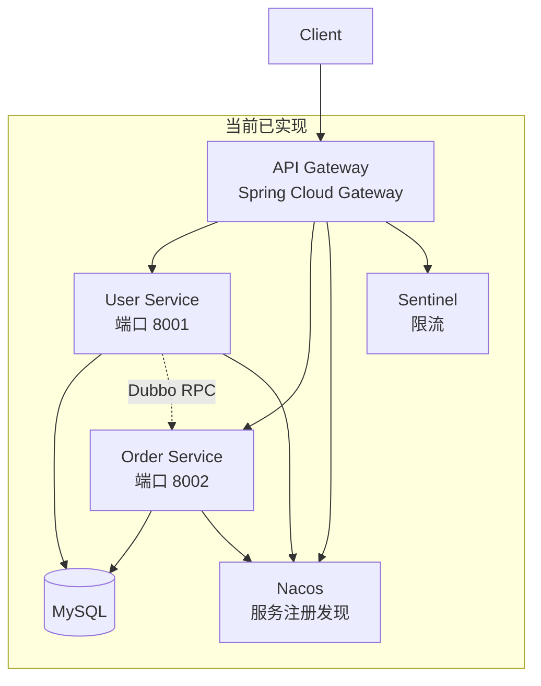
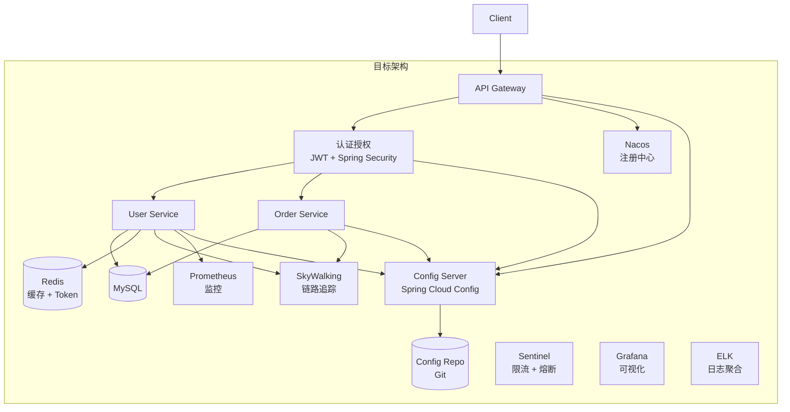

# 后端服务企业级架构完善计划

> 为 services/ 后端微服务补充企业级功能，包括认证授权、统一异常处理、API 文档、参数校验、链路追踪、监控告警等，使其达到生产环境标准。

## 任务清单

| 序号 | 阶段 | 任务 | 状态 |
|------|------|------|------|
| 1.1 | 阶段一 | 统一响应格式与全局异常处理（Result、ResultCode、BusinessException、GlobalExceptionHandler） | ✅ 已完成 |
| 1.2 | 阶段一 | 参数校验（Bean Validation + @Valid 注解） | ✅ 已完成 |
| 1.3 | 阶段一 | JWT 认证授权（新增 auth-service + 网关 JWT 过滤器） | ⬜ 待完成 |
| 1.4 | 阶段一 | API 文档（SpringDoc OpenAPI + Swagger UI） | ⬜ 待完成 |
| 2.1 | 阶段二 | 链路追踪（SkyWalking 部署与集成） | ⬜ 待完成 |
| 2.2 | 阶段二 | 监控告警（Prometheus + Grafana 部署与配置） | ⬜ 待完成 |
| 2.3 | 阶段二 | 日志聚合（ELK 部署与 Logback JSON 配置） | ⬜ 待完成 |
| 3.1 | 阶段三 | 熔断降级完善（Sentinel 熔断规则配置） | ⬜ 待完成 |
| 3.2 | 阶段三 | 配置中心（Spring Cloud Config） | ⬜ 待完成 |
| 3.3 | 阶段三 | 分布式缓存（Redis 集成与 Spring Cache） | ⬜ 待完成 |
| 4.1 | 阶段四 | 单元测试（JUnit 5 + Mockito） | ⬜ 待完成 |
| 4.2 | 阶段四 | 集成测试（Spring Boot Test + TestContainers） | ⬜ 待完成 |
| 4.3 | 阶段四 | 数据库版本管理（Flyway 迁移脚本） | ⬜ 待完成 |
| 5.1 | 阶段五 | 分布式事务（Seata，按需） | ⬜ 待完成 |
| 5.2 | 阶段五 | 消息队列（RocketMQ，按需） | ⬜ 待完成 |
| 5.3 | 阶段五 | API 版本控制（按需） | ⬜ 待完成 |

---

## 当前架构现状



## 目标架构



---

## 阶段一：核心安全与规范（高优先级）

### 1.1 统一响应格式与异常处理

**目标**：定义统一的 API 响应结构和全局异常处理

**设计原则**（参考 GitHub API、Google APIs、Stripe API 等国际主流规范）：
- 按语义返回 HTTP 状态码（2xx 成功、4xx 客户端错误、5xx 服务端错误）
- 包含 `traceId` 便于分布式链路追踪
- 结构化错误信息（`errors` 数组），前端更易处理

**新增文件**：

- `api-common/src/main/java/com/example/api/common/Result.java` - 统一响应体
- `api-common/src/main/java/com/example/api/common/ResultCode.java` - 错误码枚举
- `api-common/src/main/java/com/example/api/common/FieldError.java` - 字段校验错误详情
- `api-common/src/main/java/com/example/api/exception/BusinessException.java` - 业务异常
- `api-common/src/main/java/com/example/api/exception/GlobalExceptionHandler.java` - 全局异常处理器

**统一响应格式**：

```java
public class Result<T> {
    private int code;           // 业务错误码：0 成功，非 0 失败
    private String message;     // 错误消息
    private T data;             // 响应数据
    private long timestamp;     // 时间戳
    private String traceId;     // 链路追踪 ID
    private List<FieldError> errors;  // 字段校验错误列表（仅校验失败时返回）
}
```

**成功响应示例**：

```json
HTTP/1.1 200 OK

{
    "code": 0,
    "message": "操作成功",
    "data": { "id": 1, "name": "张三" },
    "timestamp": 1737475200000,
    "traceId": "a1b2c3d4e5f6g7h8"
}
```

**校验失败响应示例**：

```json
HTTP/1.1 400 Bad Request

{
    "code": 40001,
    "message": "参数校验失败",
    "data": null,
    "timestamp": 1737475200000,
    "traceId": "a1b2c3d4e5f6g7h8",
    "errors": [
        { "field": "name", "message": "用户名不能为空", "code": "NotBlank" },
        { "field": "email", "message": "邮箱格式不正确", "code": "Email" }
    ]
}
```

**HTTP 状态码规范**：

| 场景 | HTTP 状态码 | 说明 |
|------|-------------|------|
| 请求成功 | 200 OK | 操作成功 |
| 参数校验失败 | 400 Bad Request | 客户端请求错误 |
| 未授权 | 401 Unauthorized | 需要登录 |
| 无权限 | 403 Forbidden | 权限不足 |
| 资源不存在 | 404 Not Found | 请求的资源不存在 |
| 方法不允许 | 405 Method Not Allowed | 请求方法不支持 |
| 服务器错误 | 500 Internal Server Error | 服务端异常 |

### 1.2 参数校验

**目标**：使用 Bean Validation 进行请求参数校验

**修改文件**：

- `api-common/pom.xml` - 添加 validation 依赖
- `user-service/src/.../UserController.java` - 添加 `@Valid` 注解
- `order-service/src/.../OrderController.java` - 添加 `@Valid` 注解

### 1.3 JWT 认证授权

**目标**：实现基于 JWT 的认证授权机制

**新增模块**：`auth-service`（认证服务，端口 8003）

**新增文件**：

- `auth-service/pom.xml`
- `auth-service/src/.../AuthServiceApplication.java`
- `auth-service/src/.../controller/AuthController.java` - 登录/注册/刷新 Token
- `auth-service/src/.../service/JwtService.java` - JWT 生成与验证
- `auth-service/src/.../config/SecurityConfig.java` - Spring Security 配置

**网关集成**：

- `api-gateway/src/.../filter/JwtAuthFilter.java` - JWT 认证过滤器
- `api-gateway/src/.../config/SecurityConfig.java` - 网关安全配置

### 1.4 API 文档（SpringDoc OpenAPI）

**目标**：使用 SpringDoc OpenAPI（Spring Boot 3 官方推荐）自动生成 API 文档

**技术选型说明**：
- **SpringDoc OpenAPI** - Spring Boot 3 官方推荐，基于 OpenAPI 3.0/3.1 规范
- ~~SpringFox/Swagger~~ - 已停止维护，不支持 Spring Boot 3

**新增依赖**：
```xml
<dependency>
    <groupId>org.springdoc</groupId>
    <artifactId>springdoc-openapi-starter-webmvc-ui</artifactId>
    <version>2.3.0</version>
</dependency>
```

**修改文件**：
- `services/pom.xml` - 添加 SpringDoc OpenAPI 依赖
- 各服务 Controller 添加 `@Tag`、`@Operation`、`@Parameter` 等注解
- 各服务 `application.yml` 添加 OpenAPI 配置

**访问地址**：
- 单服务：`http://localhost:8001/swagger-ui.html`（user-service）
- 网关聚合：`http://localhost:8080/swagger-ui.html`（通过网关聚合所有服务文档）

---

## 阶段二：可观测性（中优先级）

### 2.1 链路追踪（SkyWalking）

**目标**：实现分布式链路追踪，快速定位问题

**新增文件**：

- `docker/skywalking/docker-compose.yml` - SkyWalking 部署配置
- 各服务添加 SkyWalking Agent 配置

**功能**：

- 请求链路可视化
- 服务拓扑图
- 慢查询分析

### 2.2 监控告警（Prometheus + Grafana）

**目标**：实现服务监控和告警

**新增文件**：

- `docker/prometheus/prometheus.yml` - Prometheus 配置
- `docker/grafana/dashboards/` - Grafana 仪表板
- 各服务暴露 Actuator 指标端点

**监控指标**：

- JVM 内存、GC、线程
- HTTP 请求 QPS、延迟、错误率
- 数据库连接池状态

### 2.3 日志聚合（ELK）

**目标**：集中管理和分析日志

**新增文件**：

- `docker/elk/docker-compose.yml` - ELK 部署配置
- `docker/elk/logstash/pipeline/logstash.conf` - 日志处理管道
- 各服务配置 Logback JSON 格式输出

---

## 阶段三：高可用与稳定性（中优先级）

### 3.1 熔断降级完善

**目标**：完善 Sentinel 熔断降级规则

**修改文件**：

- `api-gateway/src/.../config/SentinelGatewayConfig.java` - 添加熔断规则
- 各服务添加 `@SentinelResource` 注解

### 3.2 配置中心（Spring Cloud Config）

**目标**：使用 Spring Cloud Config 统一配置管理，支持审计与回滚

**新增模块**：

- `config-server` - Spring Cloud Config Server
- `config-repo` - 配置仓库（Git）

**修改文件**：

- 各服务 `application.yml` - `spring.config.import` 指向 Config Server

**治理模板（与 Phase 4 同步）**：

- **合规/审计**：PR 审核、变更单、分支保护、审计字段记录
- **多环境发布**：dev -> staging -> prod，生产变更可回滚
- **安全控制**：内网访问、最小权限、密钥轮换、访问日志接入 SIEM
- **质量校验**：YAML schema、敏感字段检测、环境差异校验
- **回滚与灾备**：tag 回滚、配置仓库备份、Config Server 高可用

### 3.3 分布式缓存（Redis）

**目标**：集成 Redis 缓存，提升性能

**新增文件**：

- `api-common/src/.../config/RedisConfig.java` - Redis 配置
- 各服务添加 `@Cacheable`、`@CacheEvict` 注解

---

## 阶段四：质量保障（高优先级）

### 4.1 单元测试

**目标**：添加核心业务逻辑的单元测试

**新增文件**：

- `user-service/src/test/java/.../UserServiceTest.java`
- `order-service/src/test/java/.../OrderServiceTest.java`

**测试框架**：JUnit 5 + Mockito

### 4.2 集成测试

**目标**：添加 API 端到端测试

**新增文件**：

- `user-service/src/test/java/.../UserControllerIntegrationTest.java`
- `order-service/src/test/java/.../OrderControllerIntegrationTest.java`

**测试框架**：Spring Boot Test + TestContainers

### 4.3 数据库版本管理（Flyway）

**目标**：使用 Flyway 管理数据库迁移

**新增文件**：

- `user-service/src/main/resources/db/migration/V1__init_user.sql`
- `order-service/src/main/resources/db/migration/V1__init_order.sql`

---

## 阶段五：扩展功能（低优先级）

### 5.1 分布式事务（Seata）

**适用场景**：跨服务事务一致性（如订单创建涉及库存扣减）

### 5.2 消息队列（RocketMQ）

**适用场景**：异步处理、削峰填谷、事件驱动

### 5.3 API 版本控制

**目标**：支持 API 版本管理（如 `/api/v1/users`、`/api/v2/users`）

---

## 新增目录结构

```
services/
├── api-common/                    # 共享模块（扩展）
│   └── src/main/java/com/example/api/
│       ├── common/
│       │   ├── Result.java        # [新增] 统一响应
│       │   └── ResultCode.java    # [新增] 错误码
│       ├── exception/
│       │   ├── BusinessException.java      # [新增] 业务异常
│       │   └── GlobalExceptionHandler.java # [新增] 全局异常处理
│       └── config/
│           └── RedisConfig.java   # [新增] Redis 配置
├── auth-service/                  # [新增] 认证服务
│   ├── pom.xml
│   ├── Dockerfile
│   └── src/main/java/com/example/auth/
│       ├── AuthServiceApplication.java
│       ├── controller/AuthController.java
│       ├── service/JwtService.java
│       └── config/SecurityConfig.java
├── api-gateway/                   # 网关（扩展）
│   └── src/main/java/com/example/gateway/
│       └── filter/
│           └── JwtAuthFilter.java # [新增] JWT 过滤器
├── user-service/                  # 用户服务（扩展）
│   └── src/
│       ├── main/resources/db/migration/
│       │   └── V1__init_user.sql  # [新增] 数据库迁移
│       └── test/java/...          # [新增] 测试代码
├── order-service/                 # 订单服务（扩展）
│   └── src/
│       ├── main/resources/db/migration/
│       │   └── V1__init_order.sql # [新增] 数据库迁移
│       └── test/java/...          # [新增] 测试代码
└── docker/
    ├── skywalking/                # [新增] 链路追踪
    ├── prometheus/                # [新增] 监控
    ├── grafana/                   # [新增] 可视化
    └── elk/                       # [新增] 日志聚合
```

---

## 依赖版本清单

| 依赖 | 版本 | 用途 |
|------|------|------|
| spring-boot-starter-security | 3.2.0 | 安全框架 |
| jjwt | 0.12.3 | JWT 处理 |
| springdoc-openapi-starter-webmvc-ui | 2.3.0 | API 文档（Spring Boot 3 官方推荐） |
| spring-boot-starter-validation | 3.2.0 | 参数校验 |
| spring-boot-starter-data-redis | 3.2.0 | Redis 缓存 |
| flyway-core | 10.4.1 | 数据库迁移 |
| micrometer-registry-prometheus | 1.12.0 | Prometheus 指标 |

---

## 实施建议

1. **按阶段实施**：建议按优先级分阶段实施，每阶段完成后进行测试验证
2. **先核心后扩展**：优先完成阶段一（安全规范）和阶段四（质量保障）
3. **文档同步更新**：每完成一个功能，同步更新 [java-microservices-guide.md](java-microservices-guide.md)
4. **渐进式集成**：可观测性组件可以逐步集成，不影响核心业务

---

## 更新记录

| 日期 | 更新内容 |
|------|----------|
| 2026-01-21 | 创建计划文档 |
| 2026-01-21 | 完成 1.1 统一响应格式与异常处理、1.2 参数校验 |
| 2026-01-21 | 优化：添加 traceId 字段、结构化校验错误（errors 数组）、语义化 HTTP 状态码 |
